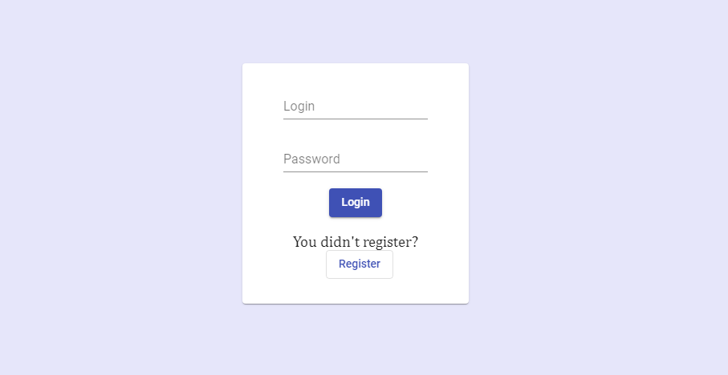
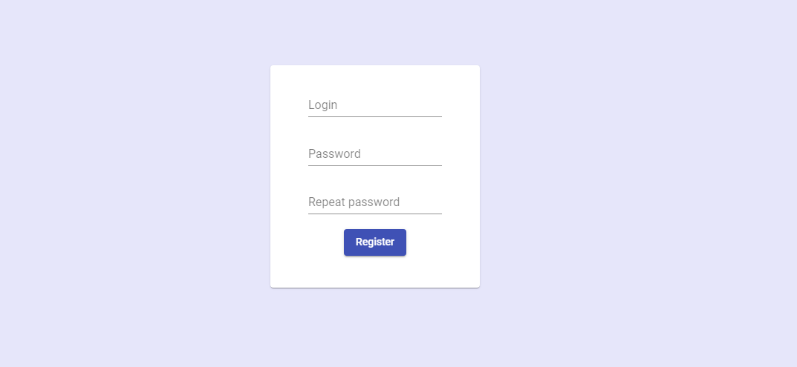
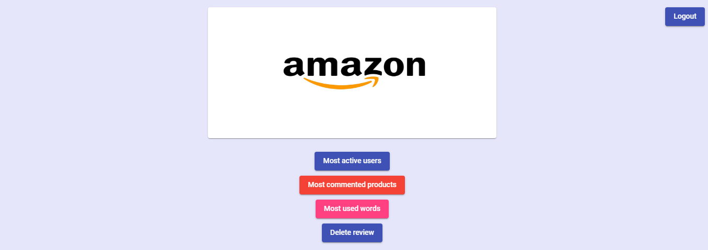
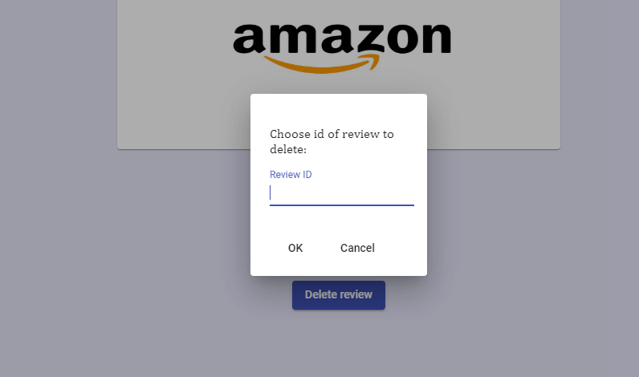
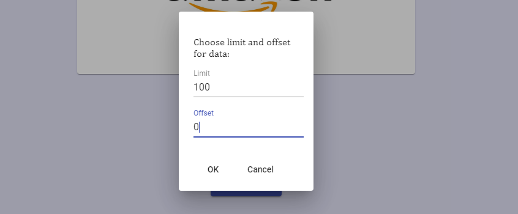
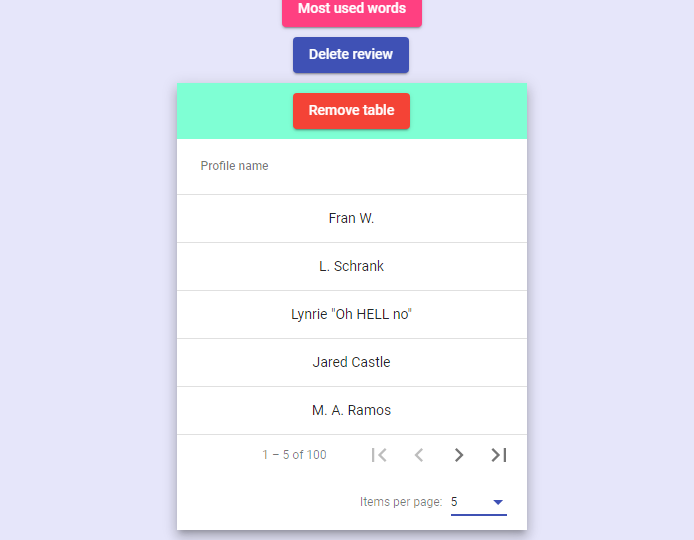
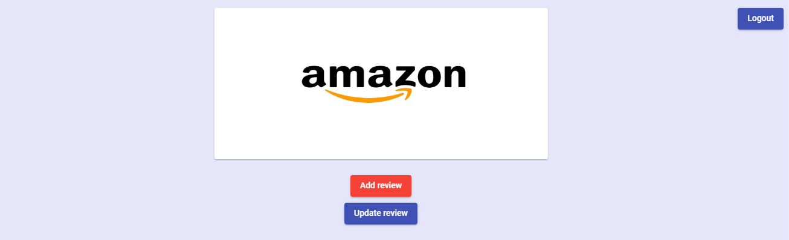
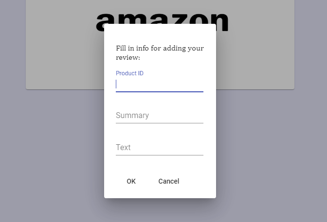
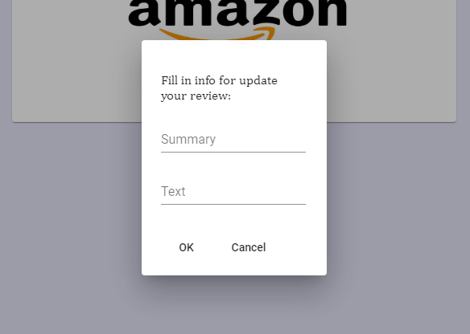

# Amazon reviews
# Table of Contents
* [Project purpose](#purpose)
* [Technologies stack](#stack)
* [For launch project](#for-launch)
* [Author](#author)

# Project purpose
Analyze and transform reviews from Amazon.

Without being authenticated you can register and login. There are specific urls for admins and users.
Only users can add new review or update it.
As admin you can delete review, and get some statistic by reviews: most active users, most commented food items, most used words in the reviews.

There are test data that you can use.
There’s one user already registered with ADMIN role (login = "admin", password = "1234") and
one user with USER role (login = "user", password = "1234"). All new users automatically get USER role.

# Technologies stack
Back-end:
* Java 11
* Spring Boot
* Spring Security(JWT Authentication)
* Spring Data JPA
* Spring Cloud
* H2 as test database
* PostgreSQL as main database
* Swagger
* Docker
* JUnit5
* Mockito 
* Lombok

Front-end:
* Angular
* HTML
* CSS
* TypeScript

# For launch project

1. Install Docker Desktop and register on DockerHub

2. Run next command in terminal from main directory: 
* docker-compose up --build

3. Open your browser on http://localhost:4200.   

# Instruction
After opening browser on http://localhost:4200 you will automatically be redirect on http://localhost:4200/login:

If you aren't registered, you can do that. For this purpose you click button 'Register' and redirect on http://localhost:4200/register: 

After that you can log in. After log in you will be redirect on http://localhost:4200/main. Depending on role you can get two different kind of main page. If you have admin role you will get such page: 
 
As admin you have an opportunity to delete review by id. You click button and dialog window opens: 
 
After entering id and pressing OK button review is deleted. Also, you can get list of most active users, most commented products, and most used words in reviews. For example get the most active users. Again we press button and get dialog window where we must fill in limit and offset for getting data:

Pressing OK button you will get data in table form that divided on pages by 10 elements: 

You can change number of elements per page from 5 to 20 elements. Ok now we can logout. Click 'Logout' button, and it will automatically redirect on http://localhost:4200/login. Now let's examine main page as user with role USER:

You can add review and update your review. Pressing 'Add review' button you again get dialog that you must fill in: 

Product ID you can get from file: backend\src\main\resources\reviews.csv.
And when you want to update text of your review you also need to fill in data in dialog window, where review will be searching by its summary:
   
  
# Author

Mykyta Arkhanhelskyi: https://github.com/Nick97-git
